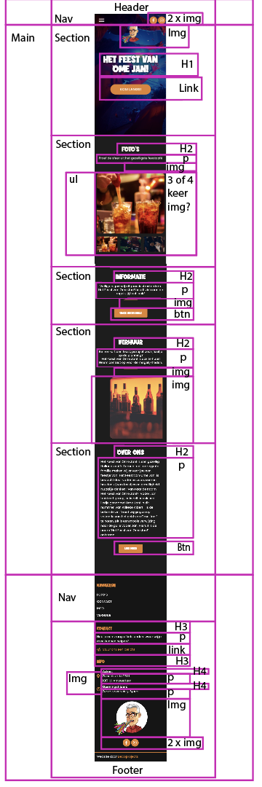
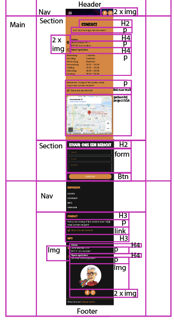

# Procesverslag
Markdown is een simpele manier om HTML te schrijven.  
Markdown cheat cheet: [Hulp bij het schrijven van Markdown](https://github.com/adam-p/markdown-here/wiki/Markdown-Cheatsheet).

Nb. De standaardstructuur en de spartaanse opmaak van de README.md zijn helemaal prima. Het gaat om de inhoud van je procesverslag. Besteedt de tijd voor pracht en praal aan je website.

Nb. Door *open* toe te voegen aan een *details* element kun je deze standaard open zetten. Fijn om dat steeds voor de relevante stuk(ken) te doen.

## Jij

### Auteur:
Annick van der Wulp

#### Je startniveau:
Mijn startniveau is blauw.

#### Je focus:
Surface plane.
 

## Je website

### Je opdracht:
https://hetfeestvanomejan.nl/ en die van mij --> file:///Users/annickwlp/Documents/Hva/jaar%202/blok%202/FED/basiswebsite/index.html

#### Screenshot(s) van de eerste pagina (small screen): 
Home, zonder 'contact' en 'stuur ons een bericht'

#### Screenshot(s) van de tweede pagina (small screen):
Aparte contact pagina

 

## Breakdownschets (week 1)

### De hele pagina: 

### Contact pagina: 

## Voortgang 1 (week 2)

### Stand van zaken
Ik heb nu we id's gebruikt om de onderdelen apart te kunnen definieren. Ook lukt het me niet om images apart te stylen. Positioneren (absolute, relative, etc.) ging wel goed! 

### Agenda voor meeting

| student 1      | student 2          | student 3    | student 4        |
| ---            | ---                | ---          | ---              |
|img apart zetten| en dit             | en ik dit    | en dan ik dat    |
| zonder id's    | dit als er tijd is | nog een punt | dit wil ik zeker |
| naar mail app  | ...                | ...          | ...              |
| uitklap boven  | ...                | ...          | ...              |

### Verslag van meeting
De meeste porblemen waren dingen die ik van te voren al wist zoals dat ik eigenlijk geen id's mag gebruiken en dat ik nth of child kan gebruiken om verschillende dingen aan te roepen. Het probleem bij deze dingen was dat ik niet wist hoe ik het wel moest doen of dat het me niet lukte, mnaar na dit gesprek weet ik dat wel! Daarnaast nog een paar dingen die ik beter anders kan doen waarvan ik niet wist dat dat zo was, maar daar ga ik mee aan de slag.

-  Icoontjes boven los van nav
-  Dingen in head niet, header maken in body
-  Misschien teveel position absolute, ipv daarvan 
-  Img position absolute daarom over elkaar

-  Bij classes en id position absolute weghalen gebruik je weinig
-  Background kleur geen positie absolute 
-  Nth of tipe ipv id 
-  Bijna alle id nth of type, behalve met specifiek voor de pagina , liever class dan id

## Voortgang 2 (week 3)

### Stand van zaken
Ik vond het lastig om alles van vorige week op t elossen maar het is me wel gelukt (met wat hulp). Ik denk dat ik wel goed op weg ben.

### Agenda voor meeting

| student 1             | student 2          | student 3    | student 4        |
| ---                   | ---                | ---          | ---              |
|tweede pagina aanroepen| en          | en ik dit    | en dan ik dat    |
| naar mail app         | dit als er tijd is | nog een punt | dit wil ik zeker |
|foto groot na klik     | ...                | ...          | ...              |
|fotos afwisselen       |
|ruimte p summary       |

### Verslag van meeting
Voor mij is het duidelijk hoe ik mijn problemen kan oplossen en waar ik nu aan kan gaan werken. Nu ik weer wat beter weet hoe ik moet coderen en mijn kennis naar boven heb gehaald en heb bijgeleerd vind ik het echt veel leuker dan aan het begin!

- Klik en groter de foto aan het einde doen, niet voor voldoende
- Fotos naast elkaar -> Div met flex box ok overflow x scroll
- Mail link ook einde -> https:// is voor website, link naar mail is a href mailto:e-mailadres 
- Lees meer overlapping -> ipv top een margin boven en onder 1 em
- Sections andere pagina class gebruiken als het niet anders kan, op de body een class zetten
- JavaScript hamburger menu is goed

## Toegankelijkheidstest (week 4)

### Bevindingen
Lijst met je bevindingen die in de test naar voren kwamen:

Screen reader:
- In footer leest hij titel contact en heb je een vraag… niet voor , stuur ons een bericht wel
- In footer hele info sectie leest hij niet voor
- Hij leest bij HomePage automatisch het hamburger menu voor zonder dat die is geopend
- HomePage leest p tekst niet voor en titels ook niet
- Headings zijn logisch

Andere beperkingen:
- Voor spasmes/Parkinson is het goed, form en button nog groter maken maar die had ik nog niet opgemaakt 
- Diabetes is gewoon helemaal prima 
- Klein rondje zicht ook prima
- P tekst is niet leesbaar met blur
- Concentratie ook prima
- Met 2 vingers aan elkaar ook prima

#### Screenreader
- In footer leest hij titel contact en heb je een vraag… niet voor , stuur ons een bericht wel
- In footer hele info sectie leest hij niet voor
- Hij leest bij HomePage automatisch het hamburger menu voor zonder dat die is geopend
- HomePage leest p tekst niet voor en titels ook niet
- Headings zijn logisch

Dat het hamburger menu automatisch wordt voorgelezen is denk ik niet zo erg, deze is ook niet lang. Ik moet voor de rest nog even een keer testen om beter erachter te komen of het echt niet werkt of dat ik er niet mee om kon gaan, het is namelijk een beetje random wat wel en niet werkt.

#### Spasmes/Parkinson
Dit ging eigenlijk wel prima. Het enige probleem was met het formulier dat nog wat klein was, maar dit had ik nog niet opgemaakt.

Dit heb ik opgelost door het formulier op te maken en de vakjes en button groter te maken.

Eerst: 

Nu: 

#### Overig zicht
- Diabetes is gewoon helemaal prima .
- Zicht bij het niet kunnen zien van het rondje in het midden van je oog is ook prima.
- P tekst is niet leesbaar met blur.

Ik zou de font size van de p tekstjes groter moeten maken.

Eerst: 

Nu: 

#### Motoriek
Een persoon die 2 vingers aan elkaar heeft kan de website eigenlijk ook prima gebruiken.

#### Concentratie
En ook als een gebruiker weinig concentratie heeft is de website goed te bedienen! Ik heb hier helaas geen beelden van.

## Voortgang 3 (week 4)

uitwerken voor 3e voortgang

### Stand van zaken
hier dit ging goed & dit was lastig (neem ook screenshots op van delen van je website en code)

### Agenda voor meeting
samen met je groepje opstellen

| student 1      | student 2          | student 3    | student 4        |
| ---            | ---                | ---          | ---              |
| dit bespreken  | en dit             | en ik dit    | en dan ik dat    |
| en dat ook nog | dit als er tijd is | nog een punt | dit wil ik zeker |
| ...            | ...                | ...          | ...              |

### Verslag van meeting

## Eindgesprek (week 5)

uitwerken voor eindgesprek

### Stand van zaken
hier dit ging goed & dit was lastig (neem ook screenshots op van delen van je website en code)

### Screenshot(s)

hier screenshot(s) van je eindresultaat

## Bronnenlijst

continu bijhouden terwijl je werkt

Nb. Wees specifiek ('css-tricks' als bron is bijv. niet specifiek genoeg).

1. Mijn eerder gemaakt programmeer werk (voor dingen zoals een form en een ifram ter inspiratie hoe het ookalweer moest).
2. Voor hamburger menu de oefeningen van de HvA van Sanne 't Hooft.
3. Alle oefingen van de HvA die Sanne 't Hooft heeft gemaakt voor voorbereiding en hulp bij het programmeren.
4. https://css-tricks.com/snippets/css/a-guide-to-flexbox/ voor het goed gebruik maken van de flexbox.
5. Ook voor hulp bij vorms https://www.w3schools.com/html/html_forms.asp
6. Ook voor hulp bij vorms https://www.w3schools.com/css/css_form.asp
7. Content van de website <a href="https://hetfeestvanomejan.nl/">

